# Transliteration Method Evaluation

Which of the four Sinhala->Romanized ("Singlish") methods best reproduces how people actually romanize Sinhala? We score each method against human reference romanizations from the Swa-bhasha Resource Hub.

## Recommendation: Phonetic (in-house)

**Phonetic (in-house) is the best method** on every corpus tested and is the recommended choice for the downstream script-robustness pipeline. It has the lowest CER and the highest chrF everywhere, and it is the only top-ranked option that is local, deterministic, free, and reproducible offline.

| Corpus | Items | Winner by CER | Runner-up |
|---|---|---|---|
| Social media (authentic sentence pairs) | 4,397 | Phonetic (in-house) (0.182) | Aksharamukha (0.191) |
| Swa-Bhasha (multi-reference words) | 450,587 | Phonetic (in-house) (0.121) | Aksharamukha (0.148) |
| Swa-Bhasha words (25k block Nisansa could cover) | 25,000 | Phonetic (in-house) (0.136) | Aksharamukha (0.163) |
| Augmented sentences (300k sample, cross-check) | 300,000 | Phonetic (in-house) (0.112) | Aksharamukha (0.139) |

Supporting points:

- **Wins the large-scale word set decisively**: CER 0.121 vs 0.148 (Aksharamukha) and 0.228 (uroman) across 450,587 words with 7.1M accepted human variants (p < 1e-300).
- **Beats Nisansa on words as well**: on the 25,000-word block Nisansa was able to cover, CER 0.136 vs 0.166, where Nisansa lands roughly level with Aksharamukha (0.163).
- **Wins authentic social-media text too**: CER 0.182 vs Nisansa 0.197, with the highest chrF (67.8 vs 63.4). See the capitalization note below - scoring case-sensitively reverses this ranking for the wrong reason.
- **Matches human spelling convention**: humans overwhelmingly use `w` (not `v`) and use aspiration and gemination at rates Phonetic reproduces closely (see convention table). Aksharamukha drops aspiration; uroman uses `v` and over-geminates.
- **Scalable, reproducible, and free**: local and deterministic, so the whole corpus can be regenerated offline. Nisansa depends on a single third-party university web endpoint: it is rate-limited by the network, can change or disappear without notice, and cannot be cited as a reproducible artifact.

**Biggest remaining gap (all methods):** over-doubling of long vowels (~0.8/token on words vs humans' ~0.12). A trivial post-process collapsing `aa/ee/ii/oo/uu` would close roughly half the residual CER to human text (relaxed CER is ~1/3 of strict).

### Note: letter case is a UI artifact, not a romanization choice

The Nisansa web form capitalizes the first letter of whatever text it is given (93% of its outputs), the three local methods never capitalize, and 84% of the human social-media references happen to start with a capital. Scoring case-sensitively therefore rewards one method for an interface side-effect - and that alone is enough to flip the social-media ranking. The primary metrics fold case; the case-sensitive column below shows the size of the artifact.

| Corpus | Method | CER (case-folded, primary) | CER (case-sensitive) |
|---|---|---|---|
| Social media (authentic sentence pairs) | Phonetic (in-house) | 0.182 | 0.216 |
| Social media (authentic sentence pairs) | Aksharamukha | 0.191 | 0.225 |
| Social media (authentic sentence pairs) | uroman | 0.228 | 0.261 |
| Social media (authentic sentence pairs) | Nisansa web | 0.197 | 0.210 |
| Swa-Bhasha (multi-reference words) | Phonetic (in-house) | 0.121 | 0.121 |
| Swa-Bhasha (multi-reference words) | Aksharamukha | 0.148 | 0.148 |
| Swa-Bhasha (multi-reference words) | uroman | 0.228 | 0.228 |
| Swa-Bhasha words (25k block Nisansa could cover) | Phonetic (in-house) | 0.136 | 0.136 |
| Swa-Bhasha words (25k block Nisansa could cover) | Aksharamukha | 0.163 | 0.163 |
| Swa-Bhasha words (25k block Nisansa could cover) | uroman | 0.224 | 0.224 |
| Swa-Bhasha words (25k block Nisansa could cover) | Nisansa web | 0.166 | 0.167 |
| Augmented sentences (300k sample, cross-check) | Phonetic (in-house) | 0.112 | 0.112 |
| Augmented sentences (300k sample, cross-check) | Aksharamukha | 0.139 | 0.139 |
| Augmented sentences (300k sample, cross-check) | uroman | 0.210 | 0.210 |

## Metrics glossary

- **CER / WER**: character / word error rate vs the closest accepted human variant (lower = better).
- **chrF, chrF++**: character n-gram F-score (higher = better); robust for morphology-rich scripts.
- **BLEU**: word-level MT metric (higher = better); least reliable here, reported for comparability.
- **Exact %**: share of items matching a human variant exactly.
- **Relaxed CER / Exact**: after canonicalizing spelling style (long vowels, w/v, aspiration, gemination) on both sides - isolates genuine phonemic error from mere spelling convention.

## Data & methodology

- **References** (Swa-bhasha Resource Hub, Sumanathilaka et al.): `social_media` - 4,397 authentic, code-mixed YouTube-comment sentence pairs; `swa_bhasha_words` - 450,587 unique words each with multiple accepted ad-hoc romanizations (7.1M total), enabling fair multi-reference scoring; `augmented_sentences_sample` - a fixed-seed 300k sample of the 7.2M machine-augmented sentence pairs, used only as a cross-check (its romanizations are themselves rule-generated, so it partly measures agreement with a generator rather than with human typing).

- **Case folding**: strict metrics are computed on case-folded text, because case reflects each tool's interface rather than its romanization scheme (see the note above).

- **Multi-reference scoring**: because Singlish is non-standard, each hypothesis is scored against the *closest* accepted human variant (oracle best reference).

- **Strict vs relaxed**: strict compares surface strings; relaxed canonicalizes spelling style on both sides. After canonicalization the three local methods agree 99.2% of the time, i.e. they are phonemically equivalent and differ only in spelling convention - so the ranking is a question of *which convention matches human typing*, which strict CER/chrF capture.

- **Significance**: percentile bootstrap 95% CIs on mean CER and paired Wilcoxon signed-rank tests against the per-corpus best method.

- **Nisansa coverage**: the web form romanizes free text line by line, so items can be batched (newline-joined) rather than sent one per request. Batched output was verified identical to one-request-per-item output, ignoring case, on all 4,253 social-media strings, and while the endpoint cooperates this runs ~78x faster (~500 items/s vs ~3/s). It will not, however, serve that volume for long: after roughly 25k words it began refusing most requests, and throughput decayed to under 6 items/s at every batch size and request spacing tried (150-350 lines/request, 0.15-2 s apart), so the refusals are load-shedding on its side rather than a rate limit that pacing can avoid. Nisansa is therefore scored on the full `social_media` corpus plus the 25,000 words it did cover - reported separately, since that block is a contiguous alphabetical slice rather than a random sample - and is absent from the augmented cross-check. Requests that fail are never substituted with untranslated text; unresolved items stay out of the cache so a rerun resumes them.

## Social media (authentic sentence pairs)

Items: 4,397. Best method by strict CER listed first.

| Method | CER | WER | chrF | chrF++ | BLEU | Exact % | Relaxed CER | Relaxed Exact % |
|---|---|---|---|---|---|---|---|---|
| Phonetic (in-house) | 0.182 | 0.606 | 67.8 | 59.3 | 28.6 | 4.2 | 0.108 | 11.8 |
| Aksharamukha | 0.191 | 0.640 | 63.7 | 55.4 | 26.3 | 3.5 | 0.108 | 11.8 |
| Nisansa web | 0.197 | 0.647 | 63.4 | 54.9 | 25.4 | 3.2 | 0.108 | 11.9 |
| uroman | 0.228 | 0.746 | 55.7 | 47.1 | 20.7 | 1.6 | 0.108 | 11.9 |

**Significance** (best = Phonetic (in-house); paired Wilcoxon on per-item CER):

| Method | CER 95% CI | p vs best |
|---|---|---|
| Phonetic (in-house) | [0.178, 0.186] | — (best) |
| Aksharamukha | [0.187, 0.195] | 2.24e-130 |
| uroman | [0.224, 0.232] | 0.00e+00 |
| Nisansa web | [0.193, 0.201] | 1.47e-180 |

## Swa-Bhasha (multi-reference words)

Items: 450,587. Best method by strict CER listed first.

| Method | CER | WER | chrF | chrF++ | BLEU | Exact % | Relaxed CER | Relaxed Exact % |
|---|---|---|---|---|---|---|---|---|
| Phonetic (in-house) | 0.121 | 0.668 | 78.7 | 64.4 | 10.6 | 33.2 | 0.040 | 74.0 |
| Aksharamukha | 0.148 | 0.761 | 69.6 | 56.1 | 0.8 | 23.9 | 0.041 | 73.5 |
| uroman | 0.228 | 0.903 | 51.6 | 40.4 | 6.0 | 9.7 | 0.044 | 71.6 |

**Significance** (best = Phonetic (in-house); paired Wilcoxon on per-item CER):

| Method | CER 95% CI | p vs best |
|---|---|---|
| Phonetic (in-house) | [0.120, 0.121] | — (best) |
| Aksharamukha | [0.147, 0.148] | 0.00e+00 |
| uroman | [0.227, 0.228] | 0.00e+00 |

## Swa-Bhasha words (25k block Nisansa could cover)

Items: 25,000. Best method by strict CER listed first.

| Method | CER | WER | chrF | chrF++ | BLEU | Exact % | Relaxed CER | Relaxed Exact % |
|---|---|---|---|---|---|---|---|---|
| Phonetic (in-house) | 0.136 | 0.687 | 76.3 | 62.9 | 0.0 | 31.4 | 0.058 | 66.3 |
| Aksharamukha | 0.163 | 0.776 | 67.3 | 54.9 | 0.0 | 22.4 | 0.059 | 66.1 |
| Nisansa web | 0.166 | 0.753 | 67.5 | 54.5 | 0.0 | 24.7 | 0.059 | 66.1 |
| uroman | 0.224 | 0.883 | 52.5 | 40.8 | 0.0 | 11.7 | 0.063 | 64.1 |

**Significance** (best = Phonetic (in-house); paired Wilcoxon on per-item CER):

| Method | CER 95% CI | p vs best |
|---|---|---|
| Phonetic (in-house) | [0.134, 0.138] | — (best) |
| Aksharamukha | [0.161, 0.164] | 0.00e+00 |
| uroman | [0.222, 0.226] | 0.00e+00 |
| Nisansa web | [0.164, 0.168] | 0.00e+00 |

## Augmented sentences (300k sample, cross-check)

Items: 300,000. Best method by strict CER listed first.

| Method | CER | WER | chrF | chrF++ | BLEU | Exact % | Relaxed CER | Relaxed Exact % |
|---|---|---|---|---|---|---|---|---|
| Phonetic (in-house) | 0.112 | 0.534 | 79.6 | 68.3 | 15.4 | 3.4 | 0.037 | 17.0 |
| Aksharamukha | 0.139 | 0.625 | 70.3 | 59.0 | 8.7 | 2.8 | 0.037 | 16.9 |
| uroman | 0.210 | 0.781 | 53.5 | 43.3 | 2.2 | 1.7 | 0.040 | 15.5 |

**Significance** (best = Phonetic (in-house); paired Wilcoxon on per-item CER):

| Method | CER 95% CI | p vs best |
|---|---|---|
| Phonetic (in-house) | [0.112, 0.113] | — (best) |
| Aksharamukha | [0.139, 0.140] | 0.00e+00 |
| uroman | [0.210, 0.211] | 0.00e+00 |

## Why: spelling-convention profile

How each method's output compares to human typing on the four axes that dominate Singlish variation. The method whose profile is closest to the human row tends to win.

### Social media (authentic sentence pairs)

| Source | v-preference (v/(v+w)) | long-vowel/tok | aspiration/tok | gemination/tok |
|---|---|---|---|---|
| Human reference | 0.20 | 0.05 | 0.15 | 0.18 |
| Phonetic (in-house) | 0.00 | 0.38 | 0.17 | 0.16 |
| Aksharamukha | 0.00 | 0.38 | 0.03 | 0.17 |
| uroman | 1.00 | 0.30 | 0.00 | 0.36 |
| Nisansa web | 1.00 | 0.38 | 0.17 | 0.16 |

### Swa-Bhasha (multi-reference words)

| Source | v-preference (v/(v+w)) | long-vowel/tok | aspiration/tok | gemination/tok |
|---|---|---|---|---|
| Human reference | 0.01 | 0.12 | 0.55 | 0.11 |
| Phonetic (in-house) | 0.00 | 0.81 | 0.56 | 0.12 |
| Aksharamukha | 0.00 | 0.81 | 0.23 | 0.14 |
| uroman | 1.00 | 0.80 | 0.00 | 0.37 |

### Swa-Bhasha words (25k block Nisansa could cover)

| Source | v-preference (v/(v+w)) | long-vowel/tok | aspiration/tok | gemination/tok |
|---|---|---|---|---|
| Human reference | 0.08 | 0.10 | 0.48 | 0.11 |
| Phonetic (in-house) | 0.00 | 0.74 | 0.51 | 0.11 |
| Aksharamukha | 0.00 | 0.74 | 0.17 | 0.12 |
| uroman | 1.00 | 0.71 | 0.00 | 0.34 |
| Nisansa web | 1.00 | 0.74 | 0.51 | 0.10 |

### Augmented sentences (300k sample, cross-check)

| Source | v-preference (v/(v+w)) | long-vowel/tok | aspiration/tok | gemination/tok |
|---|---|---|---|---|
| Human reference | 0.00 | 0.09 | 0.38 | 0.04 |
| Phonetic (in-house) | 0.00 | 0.56 | 0.38 | 0.05 |
| Aksharamukha | 0.00 | 0.56 | 0.13 | 0.06 |
| uroman | 1.00 | 0.56 | 0.00 | 0.20 |

## Figures

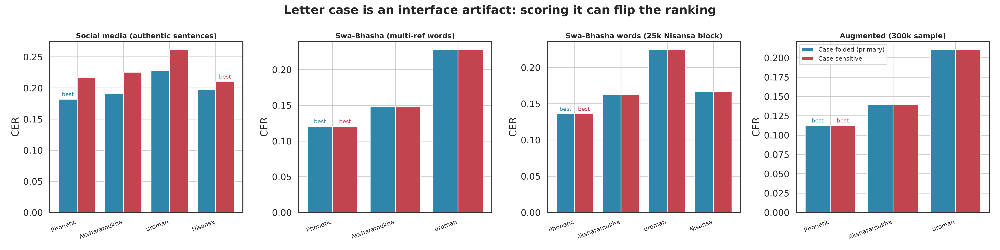

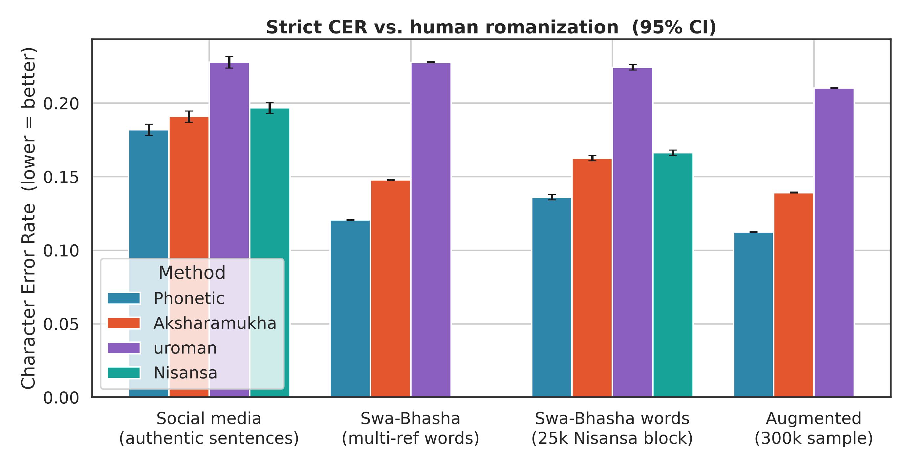

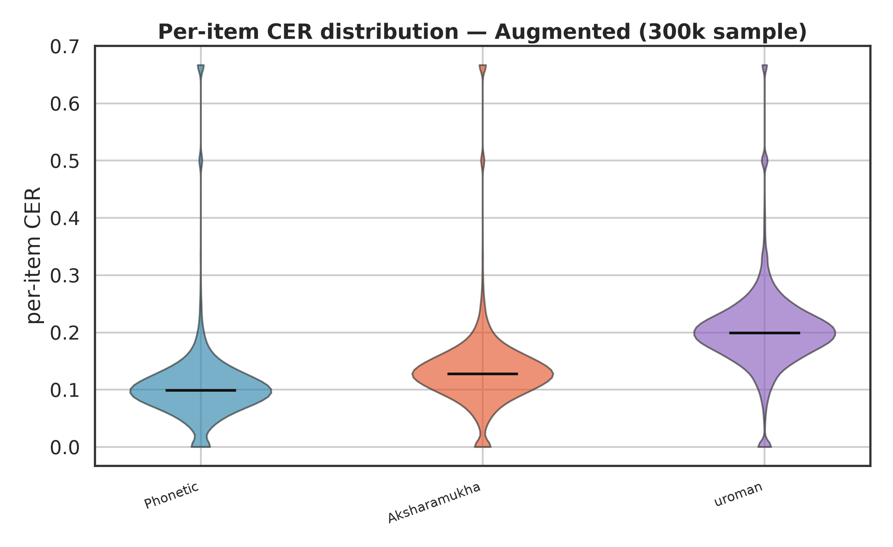

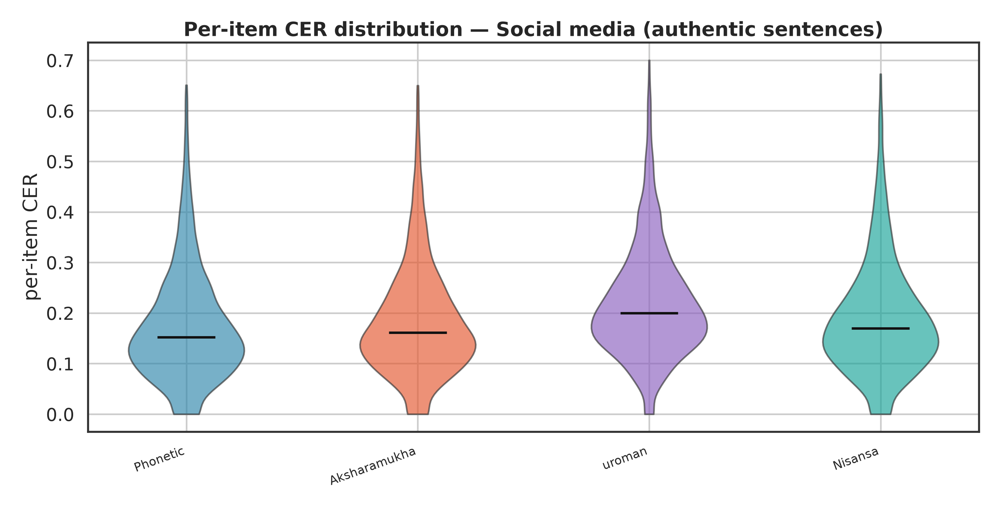

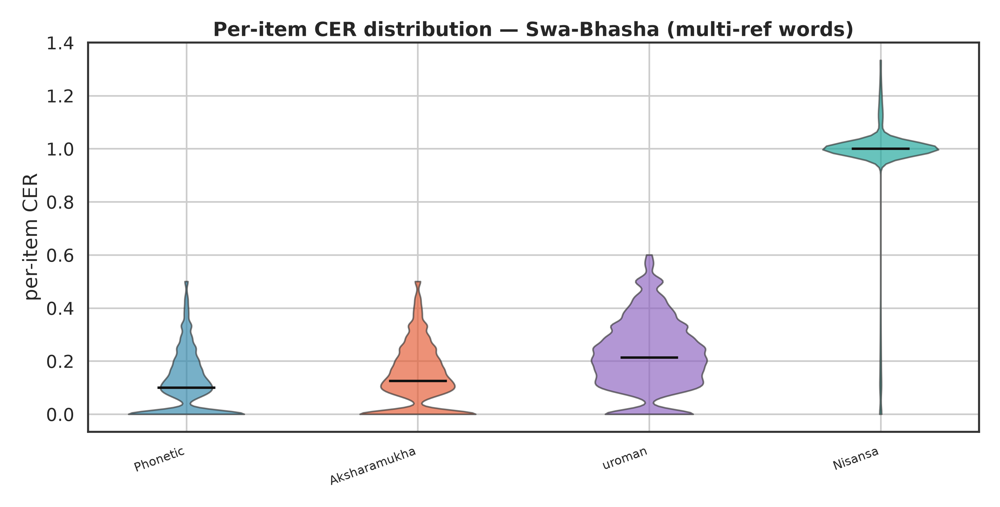

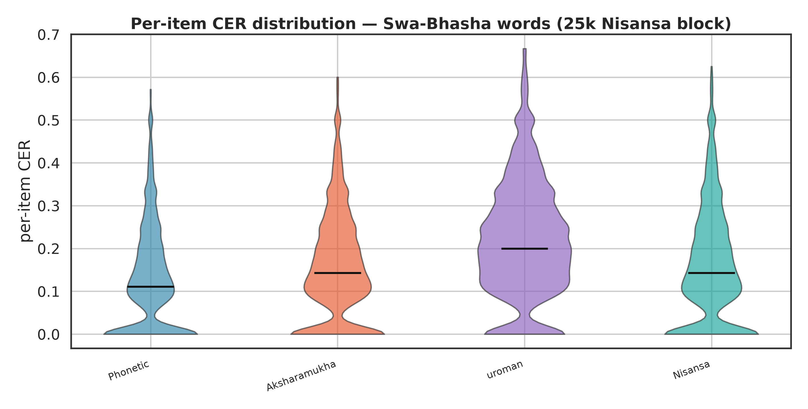

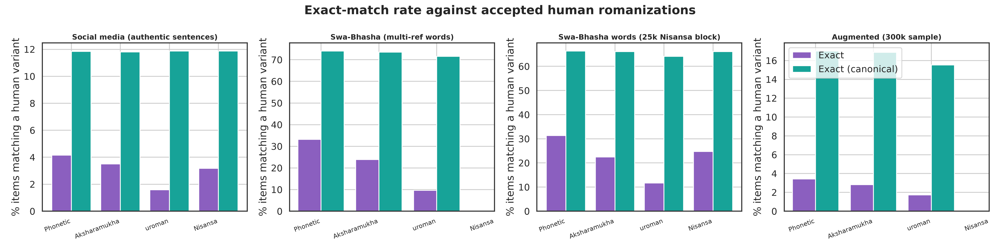

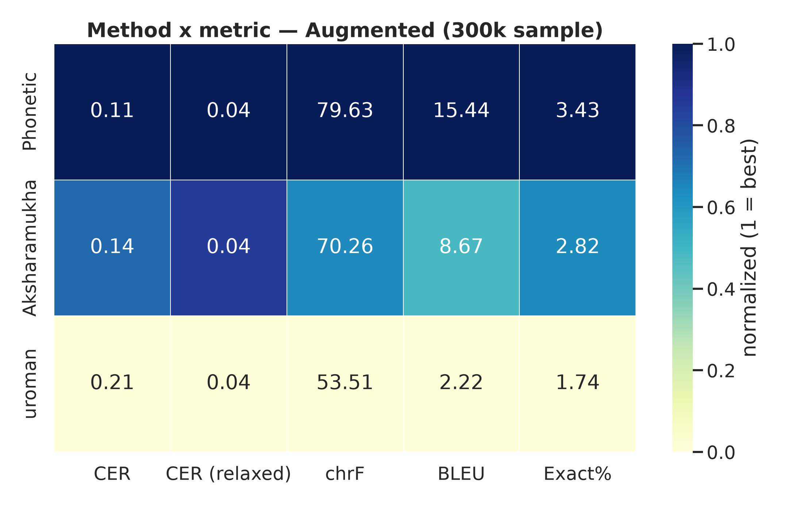

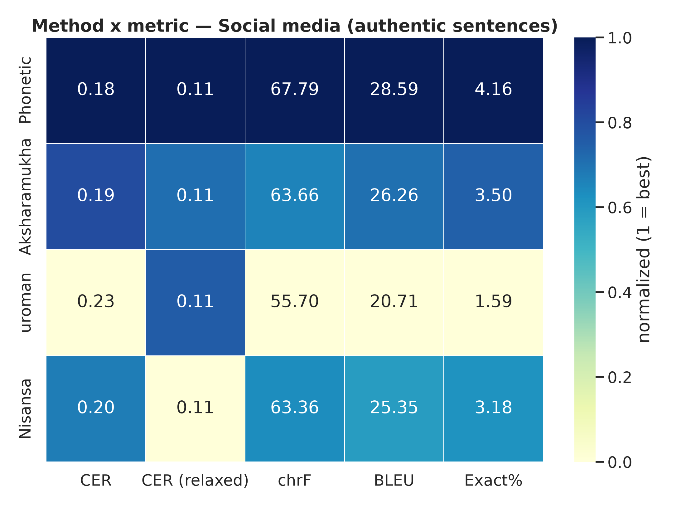

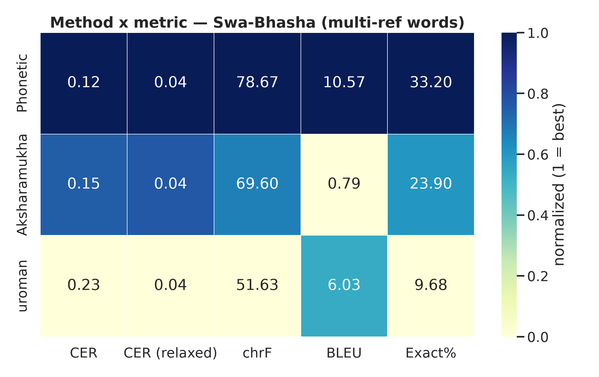

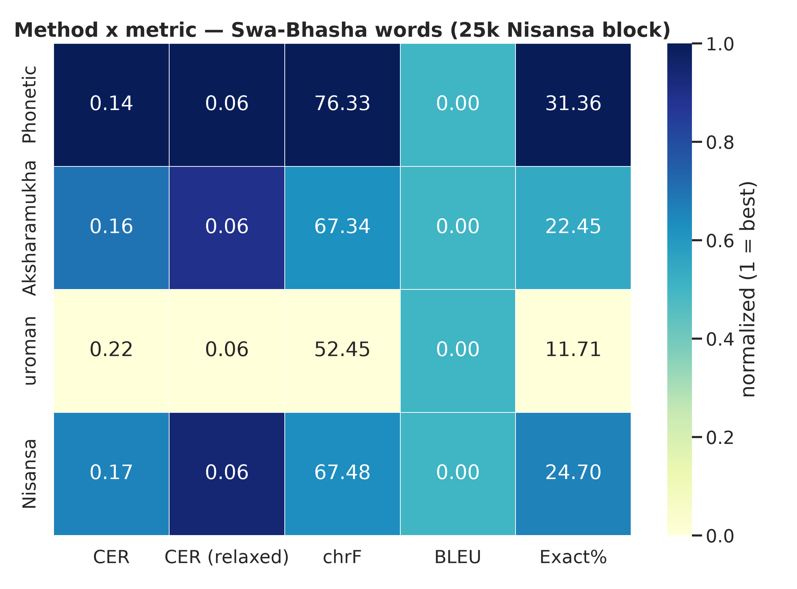

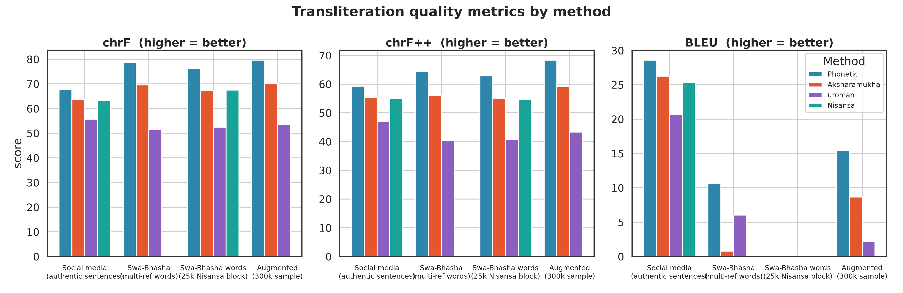

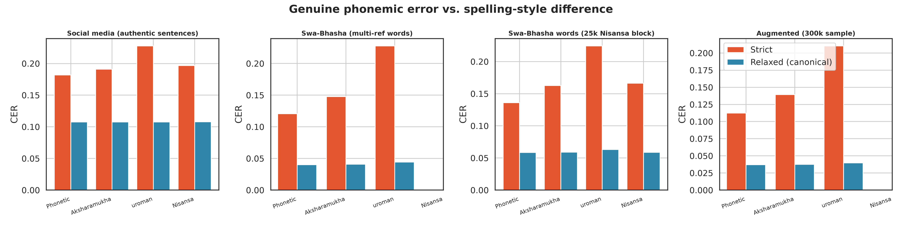
